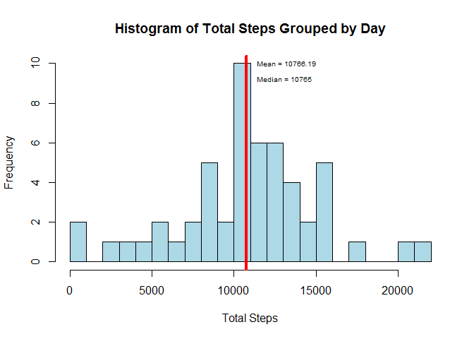
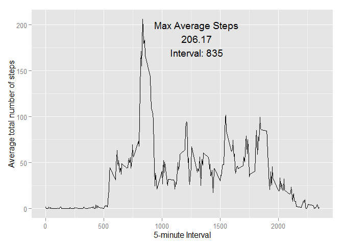
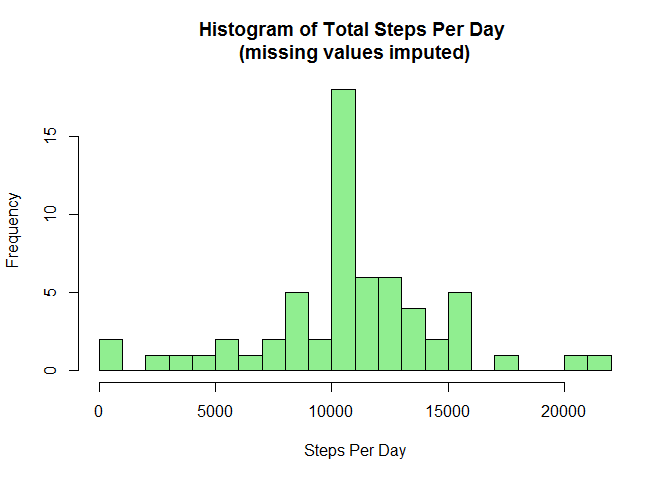
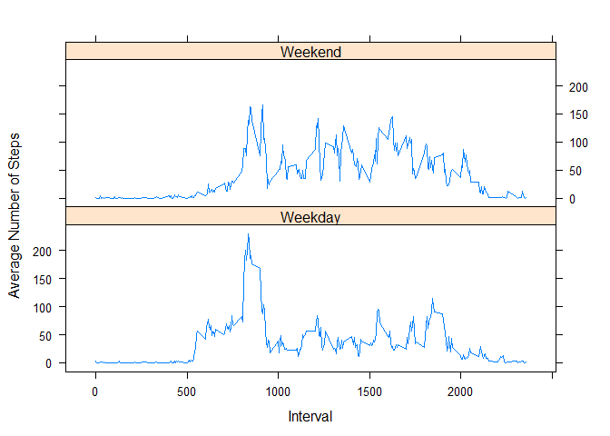

# Reproducible Research: Peer Assessment 1

This analysis will explore activity data containing measurements of steps taken in 5 minute intervals during October and November of 2012.

## Loading and Preprocessing the Data

First, install and load the packages that will be needed.


```r
# List the packages need for the analysis
pk <- c("dplyr", "ggplot2", "lattice")

# Check if the packages are already installed; install the ones that are not
sapply(pk, function(x) if (!(x %in% installed.packages())) install.packages(x))
```

```
## $dplyr
## NULL
## 
## $ggplot2
## NULL
## 
## $lattice
## NULL
```

```r
# Load the packages
sapply(pk, require, character.only = TRUE)
```

```
## Loading required package: dplyr
## 
## Attaching package: 'dplyr'
## 
## The following objects are masked from 'package:stats':
## 
##     filter, lag
## 
## The following objects are masked from 'package:base':
## 
##     intersect, setdiff, setequal, union
## 
## Loading required package: ggplot2
## Loading required package: lattice
```

```
##   dplyr ggplot2 lattice 
##    TRUE    TRUE    TRUE
```


Then download the zip file and read in the data.


```r
# Store the URL for downloading the data file
f.url <- "https://d396qusza40orc.cloudfront.net/repdata%2Fdata%2Factivity.zip"

download.file(f.url, "activity.zip")  # Download the zip file

dl.date <- date()  # Record the date when the data was downloaded

activity <- read.csv(unz("activity.zip", "activity.csv"))  # Read in the data
```


The data was downloaded on ``Sun Nov 08 18:59:05 2015``


## What is the mean total number of steps taken per day?

To get the mean total number of steps taken per day one needs to group the data by the date then calculate the mean for each group. The "dplyr" package's "group_by" and "summarize" functions can be used here.


```r
# Put the total steps grouped by day into a data frame
tsbd <- group_by(activity, date) %>%
    summarize(Total.Steps = sum(steps))
```


Using this data set one can now calculate the mean and median of total number of steps taken by day.


```r
# Calculate the mean and median total steps per day (spd)
mean.spd <- round(mean(tsbd$Total.Steps, na.rm = TRUE), 2)
median.spd <- median(tsbd$Total.Steps, na.rm = TRUE)
```


Finally, a histogram can show graphically the distribution of mean total number of steps taken per day with vertical lines showing the mean and median. In this case the mean and median are very close to one another.


```r
# Plot the histogram of total steps by day
hist(tsbd$Total.Steps, main = "Histogram of Total Steps Grouped by Day",
     xlab = "Total Steps", col = "light blue", breaks = 20)
abline(v = mean.spd, lty = 1, lwd = 4, col = "green")
abline(v = median.spd, lty = 1, lwd = 4, col = "red")
text(11000, 10, paste0("Mean = ", mean.spd), cex = 0.6, pos = 4)
text(11000, 9.2, paste0("Median = ", median.spd), cex = 0.6, pos = 4)
```

 


## What is the average daily activity pattern?

First, use the "dplyr" package to group the data by 5-minute interval and calculate the average number of steps taken during each interval. 


```r
# Put the average number of steps grouped by time interval into a data frame
msbi <- group_by(activity, interval) %>%
    summarize(Avg.Steps = mean(steps, na.rm = TRUE))
```


Store the maximum average number of steps and its corresponding 5-minute interval.


```r
# Calculate the maximum average number of steps per 5-minute period
max.avg <- max(msbi$Avg.Steps, na.rm = TRUE)

# Store the time interval corresponding to the maximum average number of steps
max.avg.int <- msbi$interval[msbi$Avg.Steps == max.avg]
```


The 5-minute interval during which the maximum average number of steps was recorded is


```r
max.avg.int
```

```
## [1] 835
```


The following is a line plot showing the average number of steps walked during each 5-minute interval.


```r
# Make a line plot of the average total number of steps by time interval
ggplot(msbi, aes(interval, Avg.Steps)) +
    geom_line() +
    annotate("text", x = 1300, y = 200, label = "Max Average Steps") +
    annotate("text", x = 1300, y = 185, label = round(max.avg, 2)) +
    annotate("text", x = 1300, y = 170, label = paste0("Interval: ", 
                                                       max.avg.int)) +
    xlab("5-minute Interval") +
    ylab("Average total number of steps")
```

 


## Imputing missing values

One way to impute values is to "hot-deck," or to fill a missing value with the average value of other similar observations. This activity data set is missing many vaules for the "steps" variable. I defined *similar* observations as those taking place during the same 5-minute interval. In this case I replaced missing "steps" values with the average number of steps for their corresponding 5-minute intervals contained in the "mbsi" data frame. As a reminder, the "mbsi" data frame has the average number of steps by 5-minute interval for all non-missing "steps" values.


```r
# Copy data set
imp <- activity

# Impute missing values by using the average number of steps of the interval
imp$steps <- ifelse(is.na(imp$steps),
                    msbi$Avg.Steps[msbi$interval %in% imp$interval], imp$steps)
```


With the missing values now imputed, one can calculate the total number of steps by time interval.


```r
# Get the total number of steps by day
tisbd <- group_by(imp, date) %>% summarize(Total.Steps = sum(steps))
```


Finally, a histogram can show how the total average steps are distributed across 5-minute intervals.


```r
# Plot the histogram of total steps by day
hist(tisbd$Total.Steps, main = paste0("Histogram of Total Steps Per Day \n",
                                    "(missing values imputed)"),
     xlab = "Steps Per Day", col = "light green", breaks = 20)
```

 


## Are there differences in activity patterns between weekdays and weekends?

To determine whether there is a difference in activity patterns between weekdays and weekends I first added a column to the data frame containing the imputed values where "steps" was originally missing. The values in this column are set to "Weekend" if the "date" value is for a Saturday or Sunday and "Weekday" otherwise.


```r
# Create a variable indicating whether the date is on a weekend or weekday
imp$DayType <- ifelse(weekdays(as.Date(imp$date), FALSE) %in%
                          c("Saturday", "Sunday"), "Weekend", "Weekday")
```


Next I grouped the data by type of day (weekday or weekend) and 5-minute interval and calculated the average number of steps taken in each 5-minute interval for weekends and weekdays respectively. 


```r
# Calculate the average number of steps by interval
avg.tisbi <- group_by(imp, DayType, interval) %>%
    summarize(AvgSteps = mean(steps))
```


The following graphic shows a two-panel line plot of the average number of steps by interval with a panel for weekend days and one for weeday days.


```r
# Create a lattice line plot of the average number of steps by interval with
# a panel for weekdays and one for weekends
xyplot(AvgSteps ~ interval | factor(DayType), data = avg.tisbi, type = "l",
       layout = c(1,2), xlab = "Interval", ylab = "Average Number of Steps")
```

 
